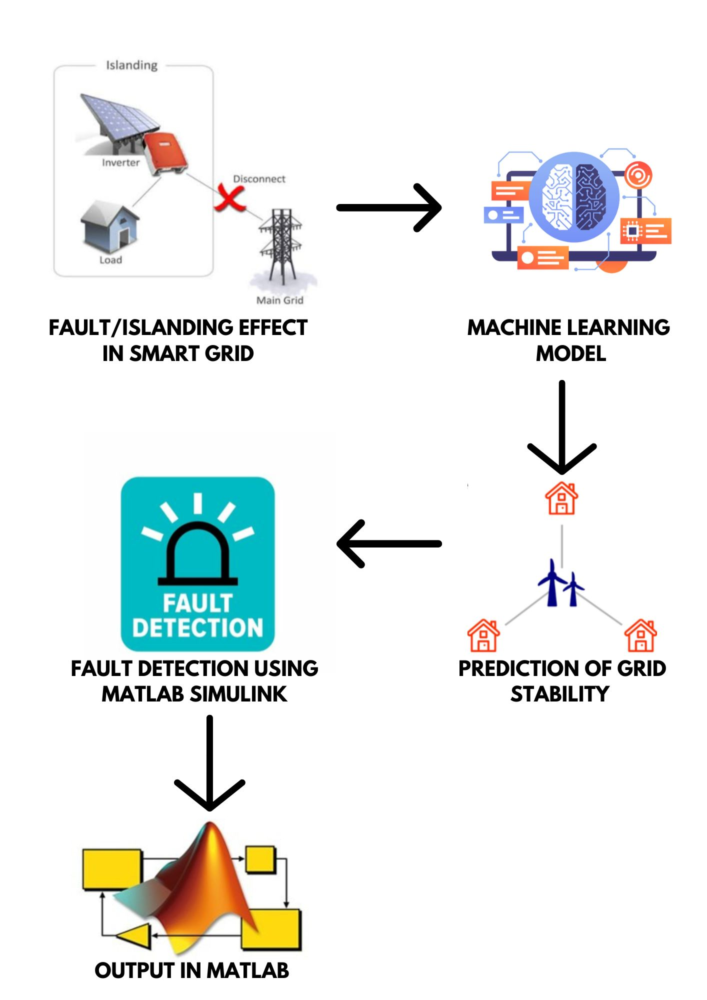
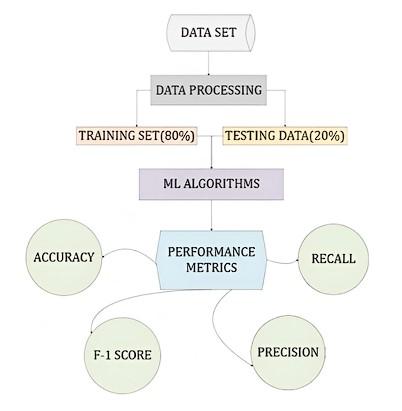
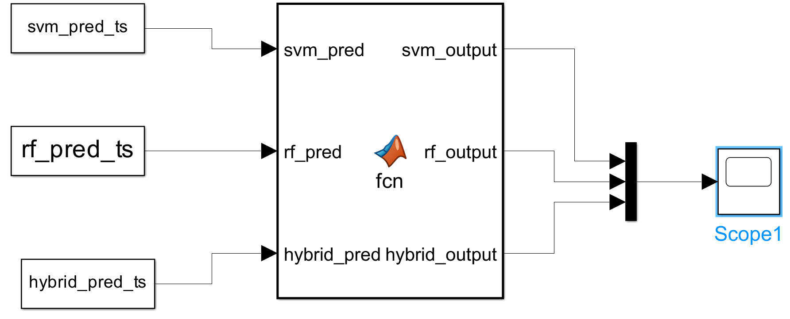
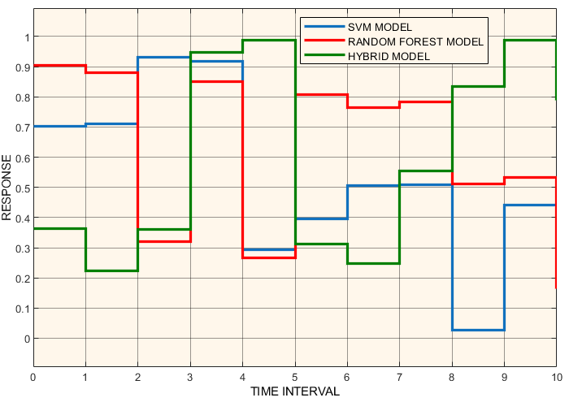

# ⚡ Hybrid Machine Learning Model for Fault Detection in Electrical Grids

<p align="center">

**A Hybrid SVM + Random Forest Approach for Electrical Grid Stability Prediction**

<br>

[](https://www.python.org/)
[](#machine-learning-models)
[](#matlab-simulink-integration)
[](#results)
[](https://link.springer.com/chapter/10.1007/978-981-96-7249-3_15)

</p>

---

## 📌 Overview

Electrical power grids require continuous monitoring to maintain reliable and stable electricity supply. Faults, overloads, power fluctuations, and other abnormal operating conditions can lead to instability, equipment damage, and outages.

This project presents a **hybrid machine learning approach combining Support Vector Machine (SVM) and Random Forest (RF)** to classify electrical grid operating conditions as **stable or unstable**.

The individual models provide complementary strengths:

* **SVM** provides effective classification through optimal decision boundaries.
* **Random Forest** provides ensemble-based robustness and reduces sensitivity to individual decision boundaries.
* Their predictions are combined through a **hybrid decision strategy** to improve classification reliability.

The proposed approach achieved **96% accuracy** and was further integrated with **MATLAB Simulink** for simulated real-time monitoring and visualization of grid stability.

---

## 🎯 Objectives

The primary objectives of this project are:

* Detect abnormal electrical grid operating conditions.
* Classify grid conditions as **Stable** or **Unstable**.
* Combine SVM and Random Forest to improve classification performance.
* Reduce the likelihood of incorrect classifications.
* Evaluate the model using standard machine learning metrics.
* Demonstrate the predictions in a simulated real-time environment using MATLAB Simulink.

---

## 🏗️ System Architecture

The overall architecture of the proposed electrical grid stability detection system combines machine learning with simulated grid monitoring.

### Fig. 1 — System Architecture

<p align="center">
  
</p>

<p align="center">
  <i>Fig. 1. System Architecture of Electrical Grid Stability</i>
</p>

---

## 🔄 Project Pipeline

The complete workflow consists of data preprocessing, model training, hybrid prediction, performance evaluation, and Simulink-based visualization.

### Pipeline

```text
Electrical Grid Dataset
          │
          ▼
   Data Preprocessing
          │
          ▼
    Feature Scaling
          │
          ▼
   Train-Test Split
        70 : 30
          │
     ┌────┴────┐
     ▼         ▼
    SVM        Random Forest
     │         │
     └────┬────┘
          ▼
   Hybrid Decision
      / Voting
          │
          ▼
 Stable / Unstable
    Classification
          │
          ▼
 Performance Evaluation
          │
          ▼
 MATLAB Simulink
 Real-Time Simulation
```

### Fig. 2 — Working Flowchart

<p align="center">
  
</p>

<p align="center">
  <i>Fig. 2. Working Flowchart of Electrical Grid Stability</i>
</p>

---

## 🧹 Data Preprocessing

The dataset is processed before model training to make the data suitable for machine learning.

The preprocessing pipeline includes:

1. Removing unnecessary columns.
2. Encoding the target variable into binary classes.
3. Splitting the dataset into training and testing sets.
4. Standardizing numerical features.
5. Preparing the processed data for SVM and Random Forest training.

### Target Classes

| Class | Meaning       |
| ----- | ------------- |
| `1`   | Stable Grid   |
| `0`   | Unstable Grid |

> **Note:** In this project, the model directly performs grid stability classification. The resulting unstable classification is used to support early detection of abnormal/fault-related operating conditions.

---

# 🤖 Machine Learning Models

## 1. Support Vector Machine (SVM)

SVM is used as one of the primary classifiers for distinguishing stable and unstable grid conditions.

The algorithm searches for an optimal decision boundary, or **hyperplane**, that separates the classes while maximizing the margin between them.

### Why SVM?

* Effective for classification problems.
* Performs well with high-dimensional feature spaces.
* Provides strong decision boundaries.
* Benefits from standardized input features.

---

## 2. Random Forest

Random Forest is an ensemble learning algorithm consisting of multiple decision trees.

Each tree produces a prediction and the ensemble combines these predictions to obtain a more robust classification.

### Why Random Forest?

* Robust against data variations.
* Reduces overfitting compared with a single decision tree.
* Captures complex decision patterns.
* Provides ensemble-based classification.

---

## 🔀 Hybrid SVM + Random Forest Model

The main contribution of the project is the combination of SVM and Random Forest.

Conceptually:

```text
                 Input Grid Data
                       │
              ┌────────┴────────┐
              ▼                 ▼
             SVM          Random Forest
              │                 │
              ▼                 ▼
         Prediction 1       Prediction 2
              │                 │
              └────────┬────────┘
                       ▼
                Hybrid Decision
                       │
                       ▼
              Stable / Unstable
```

The hybrid approach combines the classification capabilities of SVM with the ensemble robustness of Random Forest.

---

# 📊 Results

The proposed hybrid model was compared with several individual machine learning models.

| Model                   |   Accuracy |
| ----------------------- | ---------: |
| Decision Tree           |     88.60% |
| K-Nearest Neighbours    |     89.88% |
| Random Forest           |     94.52% |
| Support Vector Machine  |     95.00% |
| **SVM + Random Forest** | **96.00%** |

The hybrid model achieved the highest accuracy among the evaluated approaches.

It also demonstrated balanced precision, recall, and F1-score across stable and unstable classifications.

### Fig. 4 — Model Comparison

<p align="center">
  
</p>

<p align="center">
  <i>Fig. 4. Visual Representation of Different Machine Learning Models</i>
</p>

---

# 🖥️ MATLAB Simulink Integration

To demonstrate the behaviour of the prediction system in a simulated real-time environment, the model outputs were integrated into **MATLAB Simulink**.

The predictions from the machine learning models are imported into Simulink and visualized over time.

### Fig. 3 — Simulink Model

<p align="center">
  
</p>

<p align="center">
  <i>Fig. 3. Simulink Model for Fault Detection</i>
</p>

---

## 📈 Simulink Output

The Simulink Scope is used to visualize the model responses over time.

The output allows comparison of the individual SVM and Random Forest predictions with the hybrid prediction.

Stable and unstable responses can therefore be observed as the simulated data progresses.

### Fig. 5 — Simulink Scope Output

<p align="center">
  
</p>

<p align="center">
  <i>Fig. 5. Simulink Scope Model Output Comparison Graph</i>
</p>

---

# 📏 Evaluation Metrics

The models were evaluated using:

### Accuracy

Measures the overall proportion of correctly classified samples.

### Precision

Measures how many predicted instances of a class were actually correct.

### Recall

Measures how many actual instances of a class were correctly detected.

### F1-Score

Provides a balance between precision and recall.

These metrics are particularly important for grid monitoring because both missed abnormal conditions and unnecessary alerts can have operational consequences.

---

# 💡 Key Features

* ⚡ Electrical grid stability classification
* 🤖 Hybrid SVM + Random Forest architecture
* 📊 Comparative evaluation against multiple ML models
* 🔄 Data preprocessing and feature standardization
* 🧠 Ensemble-based decision strategy
* 📈 Accuracy, precision, recall and F1-score evaluation
* 🖥️ MATLAB Simulink integration
* ⏱️ Simulated real-time monitoring
* 🔍 Early identification of abnormal operating conditions

---

# 🛠️ Technologies Used

| Technology        | Purpose                                     |
| ----------------- | ------------------------------------------- |
| **Python**        | Machine learning implementation             |
| **Scikit-learn**  | ML algorithms and evaluation                |
| **SVM**           | Classification                              |
| **Random Forest** | Ensemble classification                     |
| **Pandas**        | Data processing                             |
| **NumPy**         | Numerical computation                       |
| **Matplotlib**    | Visualization                               |
| **MATLAB**        | Model analysis and simulation               |
| **Simulink**      | Real-time grid simulation and visualization |

---

# 📁 Repository Structure

```text
Hybrid-ML-Fault-Detection-Electrical-Grids/
│
├── README.md
│
├── notebooks/
│   ├── 01_Data_Preprocessing.ipynb
│   ├── 02_SVM_Model.ipynb
│   ├── 03_Random_Forest_Model.ipynb
│   └── 04_Hybrid_Model.ipynb
│
├── images/
│   ├── fig1_system_architecture.png
│   ├── fig2_working_flowchart.png
│   ├── fig3_simulink_model.png
│   ├── fig4_model_comparison.png
│   └── fig5_simulink_output.png
│
├── models/
│   └── trained_models/
│
├── paper/
│   └── publication.pdf
│
└── requirements.txt
```

---

# 🚀 Future Improvements

Potential future improvements include:

* Incorporating additional electrical grid parameters.
* Testing additional machine learning and deep learning algorithms.
* Hyperparameter optimization.
* Weighted hybrid voting instead of simple voting.
* Multi-class fault identification.
* Integration with live grid sensor data.
* Deployment as a real-time monitoring system.
* Automatic fault localization and classification.

---

# 📄 Publication

This project was published as a Springer conference chapter:

**Bhatta, S., Sarkar, J., Sen, M., Chatterjee, S., Chatterjee, P., & Bhowmik, T. (2025). Hybrid Machine Learning Model for Fault Detection in Electrical Grids.**

Published in *Signal Processing, Telecommunication & Embedded Systems: AI and ML Applications*, Lecture Notes in Electrical Engineering, Volume 1430, Springer.

🔗 **[Read the Published Paper on Springer](https://link.springer.com/chapter/10.1007/978-981-96-7249-3_15)**

**DOI:** `10.1007/978-981-96-7249-3_15`

---

# 👨‍💻 Authors

**Shinjan Bhatta**
**Joydeep Sarkar**
**Mekhla Sen**
**Sajili Chatterjee**
**Pratyusha Chatterjee**
**Tanima Bhowmik**

Institute of Engineering & Management, Kolkata, India.

---

## ⭐ Project Highlights

| Metric              | Result                        |
| ------------------- | ----------------------------- |
| ML Approach         | Hybrid SVM + Random Forest    |
| Task                | Grid Stability Classification |
| Classes             | Stable / Unstable             |
| Best Model          | SVM + Random Forest           |
| Accuracy            | **96%**                       |
| Simulation Platform | MATLAB Simulink               |
| Publication         | **Springer, 2025**            |
